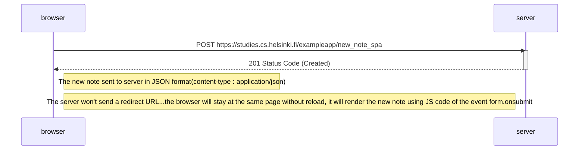

```mermaid
sequenceDiagram
    participant browser
    participant server

    browser->>server: POST https://studies.cs.helsinki.fi/exampleapp/new_note_spa
    activate server
    server-->>browser: 201 Status Code (Created) 
    deactivate server

    Note right of browser: The new note sent to server in JSON format(content-type : application/json)

    Note right of browser: The server won't send a redirect URL...the browser will stay at the same page without reload, it will render the new note using JS code of the event form.onsubmit 
```
